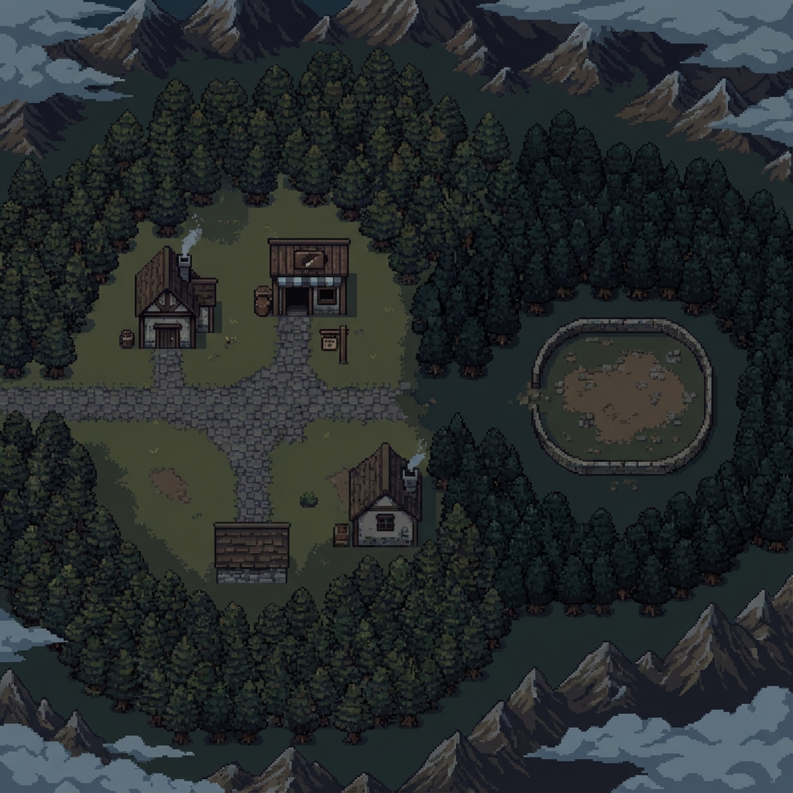

# Jayden War - 워크스루

## 플레이 방법
이 게임은 서버 의존성이 없는 웹 게임이므로 파일 시스템에서 직접 플레이할 수 있습니다!

1.  프로젝트 폴더로 이동합니다: `C:\Users\onionmen\OneDrive\Documents\Projects\jayden_war`
2.  `index.html` 파일을 더블 클릭하여 브라우저에서 엽니다.

## 🕹️ 조작법 / 게임 방법

### 1. 기본 메뉴 (이동)
- **H (집)**: 안전한 곳입니다. (R)키를 눌러 휴식하면 체력이 회복됩니다.
- **B (전투)**: 전투 상대를 선택합니다 (오크/기사/드래곤).
- **S (상점)**: 무기와 포션을 구매합니다.

### 2. 전투 (Battle)
- **스페이스바**: 적을 공격합니다.
- **숫자 1~4**: 무기를 교체합니다. (1:검, 2:총, 3:표창, 4:대검)
- **숫자 5**: 포션을 사용하여 체력을 회복합니다.
- **R (부활)**: 사망 시 부활합니다. (3회 무료, 이후 50골드)

### 3. 성장 (Level Up)
- 몬스터를 처치하면 경험치(XP)를 얻습니다.
- 경험치가 꽉 차면 레벨업하며 최대 체력이 증가합니다.
- **상대별 보상**:
    - 오크: 10 XP / 10 Gold (초보자용)
    - 기사: 30 XP / 20 Gold (중급자용)
    - 드래곤: 100 XP / 20 Gold (보스)

### 3. 상점 (Shop)
- **P**: 포션 구매 (10 골드)
- **G**: 대검(Great Sword) 구매 (50 골드) - 강력한 무기!

## 구현된 기능
- **전투 시스템**:
    - **검**: 빠름, 높은 적중률 (80%), 낮은 데미지 (2).
    - **총**: 느림 (1.5초 재장전), 낮은 적중률 (10%), 높은 데미지 (4).
    - **표창**: 즉시 시전, 완벽한 적중률, 높은 데미지, 하지만 **HP가 2 이하일 때만 사용 가능**.
    - **대검**: 강력함, 높은 적중률 (90%), 준수한 데미지 (3), **50골드에 구매 필요**.
- **경제**:
    - 승리 시 20 골드 획득.
    - 상점에서 포션 구매 가능.
- **환경**:
    - **집**: 치료를 위한 안전한 장소.
    - **상점**: 아이템 구매 장소.
    - **전투 대기**: 싸울 적을 선택하는 장소.
        1. **오크** (쉬움, 20G): 초보자용.
        2. **기사** (보통, 50G): 중급자용.
        3. **드래곤** (어려움, 200G): 최강의 적.

## 미리보기

